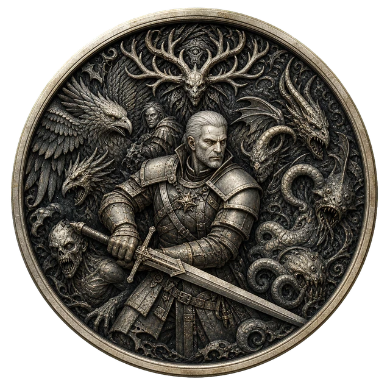
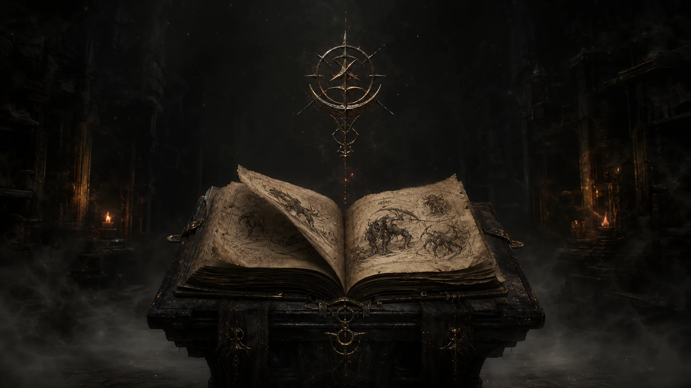

<p align="center">
  
</p>

<h1 align="center">Vespera — The Bestiary</h1>

<p align="center">
  <strong>A Witcher veteran's obsessive love letter to monsters, preparation, lore, and the Path.</strong>
</p>

<p align="center">
  An immersive, static dark-fantasy journal containing 136 creatures, handcrafted motion, and 172 original generated visual assets.
</p>

<p align="center">
  <a href="https://vespera-the-bestiary.vercel.app/"><strong>Enter the live bestiary →</strong></a>
</p>

---

## This is not a wiki

Vespera began with a simple frustration: a Witcher bestiary should not feel like
a spreadsheet with monster names attached to it.

I have spent years with this world—reading the books, playing the games,
learning which blade to draw, which oil to prepare, which Sign buys one more
second, and which creature is clever enough to make every rule unreliable.
This project was built from that kind of familiarity and affection.

It is not a portfolio exercise and it is not a commercial product. It is the
website I wanted to open as a Witcher fan: part field journal, part game menu,
part candlelit warning left behind by another hunter.

The goal is not merely to **look** like dark fantasy. The goal is to reproduce
the ritual:

1. Enter through darkness and fog.
2. Open the journal.
3. Search the catalogue by name, category, weakness, habitat, or location.
4. Study the creature before drawing a blade.
5. Prepare the correct oil, bomb, potion, and Sign.
6. Follow the trail to the next monster.

Every parchment line, slow reveal, drifting particle, creature movement, icon,
and transition exists to support that feeling.

<p align="center">
  
</p>

## What lives inside the journal

- **136 creature entries** across beasts, cursed ones, draconids, elementa,
  hybrids, insectoids, necrophages, ogroids, relicts, specters, and vampires.
- A cinematic opening sequence with fog, ambience, medallion reveal, and a
  scroll-to-open journal transition.
- A route-aware audio system that prefers optional local soundtrack files,
  crossfades between the threshold and journal, and falls back to two original
  Web Audio themes. Its draggable player remembers its position and provides
  persistent play, pause, and mute controls.
- A synthesized parchment page-turn accent shared by click, scroll, keyboard,
  and touch entry, guarded so one journal opening produces exactly one sound.
- A searchable parchment catalogue with sticky category navigation.
- Individual monster studies with lore, danger, habitat, locations, harvest,
  sword choice, oils, bombs, Signs, and known encounters.
- Continuous previous/index/next navigation for reading the bestiary like a
  real volume instead of repeatedly returning to a menu.
- Per-creature portrait motion derived from the monster slug and category, so
  the studies do not all breathe, drift, or bend in the same way.
- Responsive layouts, keyboard focus states, reduced-motion support, lazy asset
  loading, and a completely static production export.

## 172 generated images, selected and finished by hand

This project does not use one repeated placeholder portrait. The visual library
was built creature by creature.

| Artwork group                  |   Count | Purpose                                                                       |
| ------------------------------ | ------: | ----------------------------------------------------------------------------- |
| Monster portraits              | **136** | One high-detail transparent study for every creature in the catalogue         |
| Fieldcraft artwork             |  **33** | Witcher Signs, oils, bombs, potions, and combat effects                       |
| Signature artwork              |   **3** | The Vespera medallion, journal atmosphere, and steel/silver sword composition |
| **Original generated artwork** | **172** | Unique visual assets created for the experience                               |
| Derived catalogue thumbnails   | **136** | Lightweight WebP versions produced from the full portraits for fast browsing  |

The image work was iterative. Creatures were researched, prompted, reviewed,
regenerated when the anatomy or silhouette felt wrong, separated from chroma
backgrounds, cleaned to transparency, reframed for the journal, and converted
into delivery-sized WebP assets.

Even small objects received that attention. The Vampire Oil bottle, for
example, was rejected when its silhouette was damaged, rebuilt as a complete
asset, cleaned again, and re-integrated. The same care went into the medallion,
the steel and silver swords, Signs, bombs, oils, and category presentation.

The full portraits remain detailed on monster pages, while the catalogue uses
separate 7–27 KB thumbnails. That distinction preserves the artwork without
making the first page download the entire gallery.

## Codex in the workshop

[OpenAI Codex](https://openai.com/codex/) was used as an active engineering and
creative-production collaborator throughout the build.

Codex helped:

- inspect and structure the source material;
- build and validate the JSON data pipeline;
- create the Next.js architecture and reusable components;
- develop the motion language for the opening, journal, portraits, fog, and
  fieldcraft;
- direct and integrate the generated-image workflow;
- remove backgrounds and validate transparent assets;
- research missing bestiary details and encounter context;
- audit all 136 routes for consistency;
- diagnose navigation stalls and duplicate local processes;
- reduce public assets from roughly **189 MB to 35 MB**;
- prepare the static export, documentation, and repository hygiene.

The result was not produced by asking for a website once and accepting the first
answer. It came from many rounds of comparison, rejection, rewriting,
regeneration, testing, and polishing—the same stubborn loop any Witcher player
recognizes from preparing for a contract that looked easier on the notice board.

## Technology and tools

| Layer                    | Technology                                  | Role                                                                         |
| ------------------------ | ------------------------------------------- | ---------------------------------------------------------------------------- |
| Application              | **Next.js 15 App Router**                   | Static routes, metadata, and production export                               |
| Language                 | **TypeScript + React 19**                   | Strict application and component architecture                                |
| Styling                  | **Tailwind CSS + handcrafted CSS**          | Layout, parchment, fog, candlelight, ink, and responsive behavior            |
| Motion                   | **Framer Motion**                           | Opening sequence, journal transition, portrait movement, and UI presence     |
| Scroll animation         | **GSAP + ScrollTrigger**                    | Section reveals and ink-line animation                                       |
| Smooth scrolling         | **Lenis**                                   | Cinematic wheel behavior with hidden-tab and reduced-motion safeguards       |
| Soundscape               | **HTML Audio + Web Audio API**              | Shuffled playlist, silence skipping, page SFX, and silver-sword interactions |
| Data validation          | **Zod**                                     | One consistent contract across every monster JSON file                       |
| Icons                    | **React Icons**                             | Structural fallback glyphs and interface symbols                             |
| Data pipeline            | **Python, PyMuPDF, RapidOCR, ONNX Runtime** | Local document rendering, OCR, extraction, and normalization                 |
| Image pipeline           | **OpenAI image generation + Pillow**        | Original visual production, alpha cleanup, resizing, and WebP delivery       |
| Development collaborator | **OpenAI Codex**                            | Architecture, implementation, research, asset workflow, QA, and optimization |
| Deployment               | **Vercel**                                  | Global CDN delivery of the fully static production export                    |

There is no database, CMS, authentication layer, analytics dependency, or
runtime bestiary API. The website consumes static JSON and exports as portable
HTML, CSS, JavaScript, and WebP assets.

## Architecture

```text
app/                         Next.js routes, metadata, and global visual system
components/bestiary/         Catalogue and creature-detail experiences
components/experience/       Opening, ambience, medallion, motion, and scrolling
data/<category>/             One validated JSON document per creature
lib/                         Zod schema and server-side data access
public/monsters/generated/   136 optimized full creature portraits
public/monsters/thumbs/      136 lightweight catalogue thumbnails
public/icons/fieldcraft/     33 optimized Signs, oils, bombs, and effects
public/images/               Signature medallion, journal, and sword artwork
scripts/                     Extraction, enrichment, validation, and optimization
```

`generateStaticParams` creates every creature route at build time. The browser
never receives a database connection or waits for monster data from an API.

The catalogue receives compact summaries instead of complete records. Offscreen
cards use `content-visibility`, full portraits load only on their creature
routes, and expensive layout measurement was removed from the complete
136-card grid.

More implementation detail is available in
[docs/ARCHITECTURE.md](docs/ARCHITECTURE.md).

## Run it locally

Requirements:

- Node.js 20+
- npm
- Python 3.11+ only for the data, optimization, and static-preview scripts

```bash
git clone https://github.com/soufianfallah/Vespera-The-Bestiary.git
cd Vespera-The-Bestiary
npm install
npm run dev
```

Development runs at `http://localhost:3000`.

### Soundtrack files

Vespera uses a four-track soundtrack:

```text
public/audio-local/Kaer Morhen (From The Witcher 3 - Wild Hunt).mp3
public/audio-local/The Fields of Ard Skellig (Midnight).mp3
public/audio-local/1-11. Bad News Ahead Full.mp3
public/audio-local/1-13. CS001 Geralt and Yen.mp3
```

`public/audio-local/` is excluded from Git to keep large binary media outside
the source repository. Direct Vercel deployments include the local files;
builds without them automatically use Vespera's procedural themes. Every page
load starts on a shuffled track, measured leading silence is skipped, and the
draggable player provides Play/Pause and Next controls. Playback is requested
on load and retried on the first interaction when a browser's audible-autoplay
policy blocks it.

## Build and preview the real static release

```bash
npm run typecheck
npm run lint
npm run data:validate
npm run build
npm run preview
```

The optimized production preview runs at `http://localhost:3001`.

| Command                   | Purpose                                                      |
| ------------------------- | ------------------------------------------------------------ |
| `npm run check`           | Type-check, lint, and build the complete application         |
| `npm run preview`         | Serve the exported production site on port 3001              |
| `npm run assets:optimize` | Build WebP portraits, thumbnails, icons, and featured assets |
| `npm run assets:favicon`  | Rebuild browser and Apple icons from the Vespera medallion   |
| `npm run data:validate`   | Validate every committed monster document                    |
| `npm run data:extract`    | Build structured creature data from a local source PDF       |
| `npm run data:enrich`     | Apply reviewed research and enrichment data                  |

To rebuild repository-ready artwork and remove validated source PNGs:

```bash
python scripts/optimize_assets.py --prune-sources
```

## Data and source material

The original local reference PDF is intentionally excluded from Git. The
committed JSON and optimized assets are sufficient to build and deploy the
website.

Monster information lives outside React components. Each creature follows the
same schema, category normalization, navigation behavior, and rendering path.
That separation keeps the experience handcrafted without turning the codebase
into 136 hardcoded pages.

## A final note from the Path

Vespera was built because this world still has the power to make preparation
feel meaningful.

The bestiary in The Witcher is not decoration. It is the difference between
meeting a monster and understanding one. It turns folklore into tactics and
fear into preparation. This project tries to honor that idea—not by copying a
game menu, but by building an original journal with the same patience, menace,
and respect for the hunt.

If you notice an unnecessary detail, it is probably there because a Witcher fan
argued with himself about it for far too long.

---

Vespera is an unofficial, personal, non-commercial fan project. The Witcher and
its related intellectual property belong to their respective rights holders.
This project is not affiliated with or endorsed by CD PROJEKT RED, CD PROJEKT,
or Andrzej Sapkowski. See [NOTICE.md](NOTICE.md).
